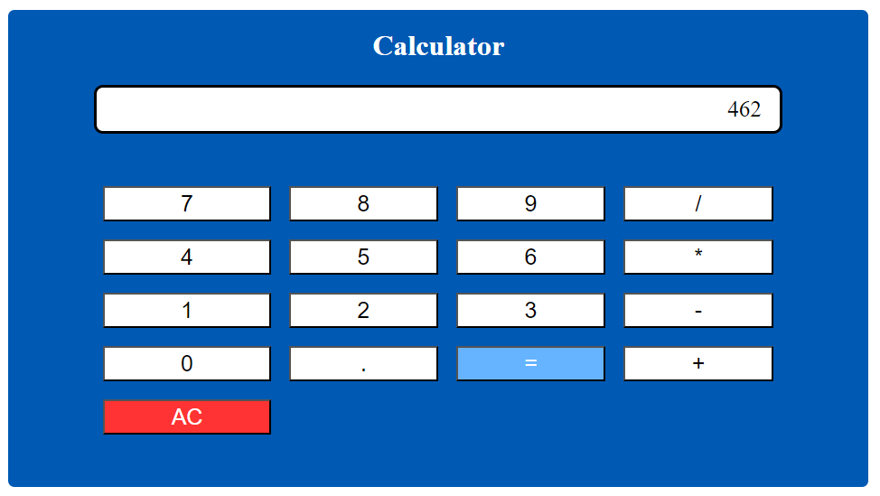

# JS-Calculator

Calculator created with JavaScript. 
 
 
The app permits the user to add, subtract, multiply and divide a chain of numbers of any length, showing the correct result when you hit '='. It allows any operation (+, -, *, /) on numbers containing decimal points, having several decimal places of precision when it comes to rounding.
 
 
If 2 or more operators are entered consecutively, the operation performed will be the last operator entered. Pressing an operator immediately following '=' will start a new calculation that operates on the result of the previous evaluation.

 

| [:camera: Screenshots](#screenshots) | [🤝 Contributing](#contributing) | [🔖 License](#license) |
|  -------- | ----------- | ----------- |

 

## Screenshots

 

## Contributing
If you want to contribute to this proyect, follow these steps:

 

1. Fork the repository.
3. Clone your fork.
4. Check that your fork is the "origin" remote.
5. Add the project repository as the "upstream" remote using `git remote add upstream https://github.com/ricardobar96/JS-Calculator.git`.
6. Pull the latest changes from upstream into your local repository using `git pull upstream master`.
7. Create a new branch using `git checkout -b BRANCH_NAME`.
8. Make your changes and commit them: `git commit -m 'DESCRIPTION OF CHANGES'`.
9. Push your changes to your fork `git push origin BRANCH_NAME`.
10. Create a pull request.
 
 

If you have any doubts, consult [this](https://www.dataschool.io/how-to-contribute-on-github/) guide

 

## License
This project is licensed under the [MIT License](LICENSE.txt)
